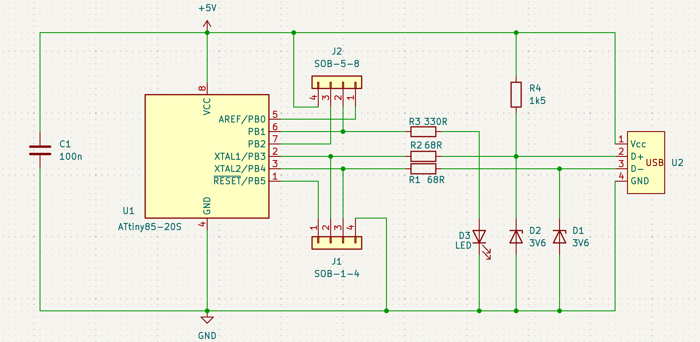
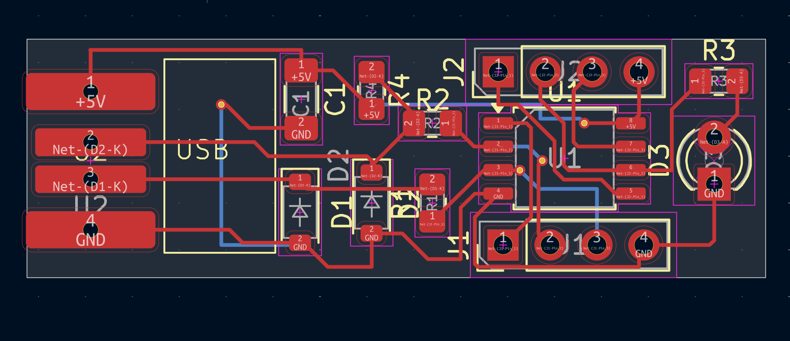
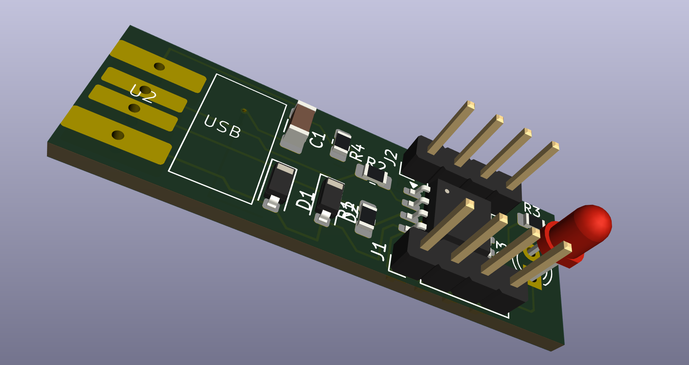

# ATtiny85-USB-PCB

## Overview

This project is an ATtiny85-based USB device designed using KiCad.

The circuit uses the ATtiny85 microcontroller together with USB
data-line resistors, Zener protection diodes, a USB pull-up resistor,
and a decoupling capacitor.

## Tools Used

- KiCad

## Hardware

- ATtiny85
- USB connector
- 68 Ω resistors
- 3.6 V Zener diodes
- 1.5 kΩ resistor
- 330 Ω resistor
- LED
- 100 nF capacitor

## Project Files

- Schematic: `schematic/`
- PCB Layout: `pcb/`
- Gerber Files: `gerbers/`

## PCB Design

### Schematic

### PCB Layout

### 3D View

## Learning Outcome

This project helped me learn schematic capture, component
footprints, PCB component placement, routing, and design
verification in KiCad.

## Reference

This design was created as a learning project with reference to
an online tutorial/design.
